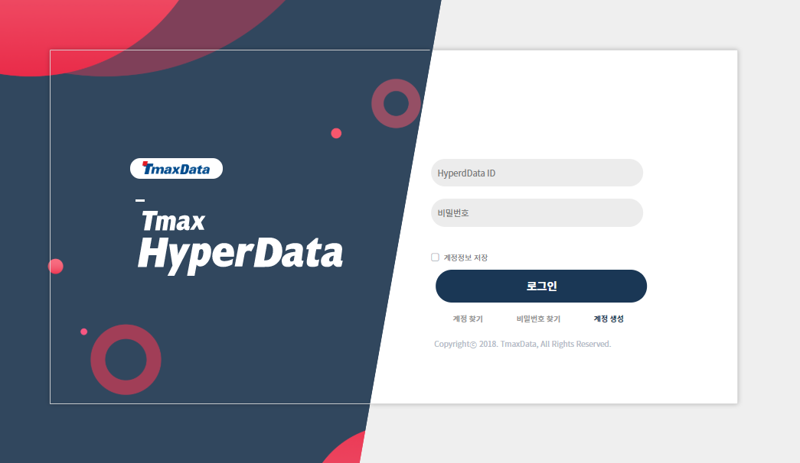

== HyperData 설치(On Kubernetes)

본 절에서는 Kubernetes 환경에서 HyperData를 설치하는 방법을 기술한다.

=== 개요
Kubernetes 환경에서 HyperData는 다음의 과정으로 설치를 진행한다. 각 단계의 자세한 내용은 해당 절
의 설명을 참고한다.

1. 이미지 확인 +
2. 네임스페이스 생성 +
3. Tibero, HyperLoader, HyperData 서비스 생성 +
4. Tibero 스토리지 생성 +
5. Tibero, HyperLoader, Recommend-Module, HyperData 파드 생성 +
설치가 완료되면 HyperData에 접속하여 정상 설치 여부를 확인한다. 자세한 내용은 “2.7. 설치 확인”를 참
고한다.

=== 이미지 확인
컨테이너 생성을 위한 이미지를 확인한다. HyperData 설치 이미지가 저장된 레지스트리가 구축되어 있어
야 한다. 도커 레지스트리 주소는 {ip}:{port} 형태로 설정한다.

도커 레지스트리의 이미지를 확인하는 방법은 다음과 같다.

1. 이미지 이름을 확인한다.
조회되는 이미지 목록은 hyperdata8.3_tb, hyperdata8.3_hl, hyperdata8.3_eda, hyperdata8.3_hd 이다.
----
[root@master ~]# curl -X GET 192.168.105.224:5000/v2/_catalog
{"repositories":["hyperdata8.3_eda","hyperdata8.3_hd","hyperdata8.3_hl","hyperdata8.3_tb"]}
----
[start=2]
2. 이미지 이름을 확인한 후 태그 리스트를 확인한다.
----
[root@master ~]# curl -X GET 192.168.105.224:5000/v2/hyperdata8.3_hd/tags/list
{"name":"hyperdata8.3_hd","tags":["20200507_v1","20200513_v1","20200513_v2"]}
----

=== 네임스페이스 생성
HyperData 설치를 위해 네임스페이스 야믈 파일을 생성하고 배포한다. +

1. 네임스페이스 야믈 템플릿을 생성한다.
----
apiVersion: v1
kind: Namespace
metadata:
    name: hyperdata
    labels:
    app: hd
----
[start=2]
2. HyperData 네임스페이스를 kubectl 명령어로 배포한다.
----
[root@master ~]# kubectl create -f namespace.yaml
----
[start=3]
3. HyperData 네임스페이스가 정상적으로 배포했는지 확인한다.
----
[root@master ~]# kubectl get namespace
NAME STATUS AGE
hyperdata         Active     16s
kube-node-lease   Active     14d
kube-public       Active     14d
kube-system       Active     14d
rook-ceph         Active     14d
----

=== 서비스 생성

HyperData 기동을 위한 서비스를 생성한다. 본 안내서에서는 서비스를 로드밸런서로 배포하며 외부 통신
이 가능한 퍼블릭 IP가 미리 준비되어 있다는 가정하에 진행한다.

==== Tibero 서비스 생성
Tibero 서비스 생성을 위해 야믈 파일을 생성하고 배포한다.

1. Tibero 서비스 야믈 파일(lb-db.yaml)을 생성한다.
----
apiVersion: v1
kind: Service
metadata:
  name: hyper-db-lb
  namespace: hyperdata
  labels:
    lb: hyoer-lb
  annotations:
    metallb.universe.tf/allow-shared-ip: top
spec:
  ports:
    - name: tb-lsnr
      nodePort: 30694
      port: 8629
      protocol: TCP
      targetPort: 8629
  selector:
    lb: db-lb
  type: LoadBalancer
  sessionAffinity: None
  loadBalancerIP: 192.168.179.184
  externalTrafficPolicy: Cluster
----
* 다음은 서비스 포트 정보이다.

[cols="2,8" options=header]
|===
|포트 |	설명
|tb-lsnr	| tb-lsnr 포트 정보 (기본값: 8629)
|===

* nodePort 값은 30000-32767 포트 사이의 임의의 포트로 설정한다. +
* loadBalancerIP 값은 외부통신이 가능한 IP로 설정하며 db,hl,hd 서비스 모두 동일한 IP를 공유한다.

[start=2]
2. Tibero 서비스를 kubectl 명령어로 배포한다.
----
[root@master ~]# kubectl create -f lb-db.yaml
----

3.HyperData 서비스가 정상적으로 배포되었는지 확인한다.
----
[root@master ~]# kubectl get svc -n hyperdata
NAME          TYPE           CLUSTER-IP       EXTERNAL-IP        PORT(S)         AGE
hyper-db-lb   LoadBalancer   10.104.214.249   192.168.179.184  8629:31094/TCP  26h
----

==== HyperLoader 서비스 생성

HyperLoader 서비스 생성을 위해 야믈 파일을 생성하고 배포한다.

1. HyperLoader 서비스 야믈 파일(lb-hl.yaml)을 생성한다.
----
apiVersion: v1
kind: Service
metadata:
  name: hyper-hl-lb
  namespace: hyperdata
  labels:
    lb: hyoer-lb
  annotations:
    metallb.universe.tf/allow-shared-ip: top
spec:
  ports:
    - name: hl-admin
      nodePort: 30626
      port: 23000
      protocol: TCP
      targetPort: 23000
    - name: ll-adapter
      nodePort: 30622
      port: 1555
      protocol: TCP
      targetPort: 1555
  selector:
    lb: hl-lb
  type: LoadBalancer
  sessionAffinity: None
  loadBalancerIP: 192.168.179.184
  externalTrafficPolicy: Cluster
----

* 다음은 서비스 포트 정보이다.

[cols="2,5" options=header]
|===
|포트 |설명
|hl-admin	| hl-admin 포트 정보 (기본값: 23000)
|ll-adapter |	ll-adapter 포트 정보 (기본값: 1555)
|===
* nodePort 값은 30000-32767 포트 사이의 임의의 포트로 설정한다.
* loadBalancerIP 값은 외부통신이 가능한 IP로 설정하며 db,hl,hd 서비스 모두 동일한 IP를 공유한다.

[start=2]
2. HyperLoader 서비스를 kubectl 명령어로 배포한다.
----
[root@master ~]# kubectl create -f lb-hl.yaml
----

[start=3]
3. HyperLoader 서비스가 정상적으로 배포되었는지 확인한다.
-----
[root@master ~]# kubectl get svc -n hyperdata
NAME          TYPE           CLUSTER-IP       EXTERNAL-IP        PORT(S)                          AGE
hyper-db-lb   LoadBalancer   10.104.214.249   192.168.179.184  8629:31094/TCP                   26h
hyper-hl-lb   LoadBalancer   10.106.16.114    192.168.179.184  23000:31196/TCP,1555:31206/TCP   26h
-----

==== HyperData 서비스 생성
HyperData 서비스 생성을 위해 야믈 파일을 생성하고 배포한다.

1. HyperData 서비스 야믈 파일(lb-hd.yaml )을 생성한다.
----
kind: Service
apiVersion: v1
metadata:
  name: hyper-hd-lb
  namespace: hyperdata
  labels:
    lb: hyoer-lb
  annotations:
    metallb.universe.tf/allow-shared-ip: top
spec:
  ports:
    - name: ftp
      nodePort: 32314
      port: 20
      protocol: TCP
      targetPort: 20
    - name: ftp2
      nodePort: 32324
      port: 21
      protocol: TCP
      targetPort: 21
    - name: ssh
      nodePort: 32334
      port: 22
      protocol: TCP
      targetPort: 22
    - name: telnet
      nodePort: 32344
      port: 23
      protocol: TCP
      targetPort: 23
    - name: http
      nodePort: 32364
      port: 80
      protocol: TCP
      targetPort: 80
    - name: hd-http
      nodePort: 32384
      port: 8080
      protocol: TCP
      targetPort: 8080
    - name: jeus-http
      nodePort: 32389
      port: 9736
      protocol: TCP
      targetPort: 9736
    - name: proauth-http
      nodePort: 32164
      port: 28080
      protocol: TCP
      targetPort: 28080
    - name: msqt-lsnr1
      nodePort: 32194
      port: 1883
      protocol: TCP
      targetPort: 1883
    - name: msqt-lsnr2
      nodePort: 32204
      port: 2883
      protocol: TCP
      targetPort: 2883
    - name: hd-web
      nodePort: 32214
      port: 1408
      protocol: TCP
      targetPort: 1408
  selector:
    lb: hd-lb
  type: LoadBalancer
  sessionAffinity: None
  loadBalancerIP: 192.168.179.184
  externalTrafficPolicy: Cluster
----
* 다음은 서비스 포트 정보이다.

[cols="2,5" options=header]
|===
|포트	| 설명
|ftp |ftp 포트 정보 (기본값: 20)
|ftp2 | ftp2 포트 정보 (기본값: 21)
|ssh | ssh 포트 정보 (기본값: 22)
|telnet |	telnet 포트 정보 (기본값: 23)
|http |	http 포트 정보 (기본값: 80)
|hd-http |	HyperData 웹 포트 정보 (기본값: 8080)
|jeus-http |	JEUS 웹 포트 정보 (기본값: 9736)
|proauth-http |	ProAuth 포트 정보 (기본값: 28080)
|msqt-lsnr1 |	모스키토 웹 접속 포트1 (기본값: 1883)
|msqt-lsnr2 |	모스키토 웹 접속 포트2 (기본값: 2883)
|hd-web |	hd-web 웹 포트 정보 (기본값: 1408)
|===
* nodePort 값은 30000~32767 포트 사이의 임의의 포트로 설정한다.
* loadBalancerIP 값은 외부통신이 가능한 IP로 설정하며 db, hl, hd 서비스 모두 동일한 IP를 공유한다.

[start=2]
2. HyperData 서비스를 kubectl 명령어로 배포한다.
----
[root@master ~]# kubectl create -f lb-hd.yaml
----

[start=3]
3. HyperData 서비스가 정상적으로 배포되었는지 확인한다.
----
[root@master ~]# kubectl get svc -n hyperdata
NAME          TYPE           CLUSTER-IP       EXTERNAL-IP        PORT(S)                          AGE
hyper-db-lb   LoadBalancer   10.104.214.249   192.168.179.184  8629:31094/TCP                    26h
hyper-hl-lb   LoadBalancer   10.106.16.114    192.168.179.184  23000:31196/TCP,1555:31206/TCP    26h
hyper-hd-lb   LoadBalancer   10.105.5.75      192.168.179.184  20:31014/TCP,21:31024/TCP,22:3..  26h
----

=== 스토리지 생성
HyperData 기동을 위한 스토리지를 생성한다. 본 안내서에서는 동적 프로비저닝을 위해 Kubernetes 내 스토리지 클래스가 미리 구축되어 있다는 가정 하에 분산 스토리지 엔진인 룩쉐프(rook-ceph)을 이용해 스토리지 클래스를 구성한다.

==== Tibero 스토리지 생성
Tibero 스토리지 생성을 위해 야믈 파일을 생성하고 배포한다.

1. Tibero 스토리지 야믈 파일(pvc-db.yaml)을 생성한다.
----
apiVersion: v1
kind: PersistentVolumeClaim
metadata:
  labels:
    app: hd
  name: pvc-db
  namespace: hyperdata
spec:
  accessModes:
  - ReadWriteMany
  resources:
    requests:
      storage: 10000Mi
  storageClassName: csi-cephfs-sc
  volumeMode: Filesystem
----
* spec.resources 부분은 사용자 환경에 맞게 변경한다.
* storageClassName은 미리 준비한 스토리지 클래스로 설정한다. 본 안내서에서는 분산 파일 스토리지인 csi-cephfs 형태의 스토리지 클래스를 구성하였다.
* 다음의 명령어를 사용해서 스토리지 클래스를 조회한다.
----
[root@master ~]# kubectl get storageclass
NAME                      PROVISIONER                     AGE
csi-cephfs-sc (default)   rook-ceph.cephfs.csi.ceph.com   14d
rook-ceph-block           rook-ceph.rbd.csi.ceph.com      14d
----

[start=2]
2. Tibero 스토리지를 kubectl 명령어로 배포한다.
----
[root@master ~]# kubectl create -f pvc-db.yaml
----

[start=3]
3. Tibero 스토리지가 정상적으로 배포했는지 확인한다.
----
[root@master ~]# kubectl get pvc -n hyperdata
NAME     STATUS   VOLUME                                     CAPACITY   ACCESS MODES   STORAGECLASS    AGE
pvc-db   Bound    pvc-153514e4-702e-4a2f-a2d2-dcdba91e4881   10Gi       RWX            csi-cephfs-sc   43d
----

=== 파드 생성
HyperData 설치를 위해 앞서 파드를 배포한다.

==== Tibero 파드 생성
Tibero 파드를 배포하기 위해 야믈 파일을 작성하고 배포한다.

1. 다음은 Tibero 파드 야믈 파일(db.yaml) 템플릿이다.
----
apiVersion: v1
kind: Pod
metadata:
  labels:
    lb: db-lb
  name: pod-db-hd
  namespace: hyperdata
spec:
  containers:
  - env:
    - name: TB_PORT
      value: "8629"
    - name: MAX_SESSION_COUNT
      value: "100"
    - name: TOTAL_SHM_SIZE
      value: "8"
    - name: MEMORY_TARGET
      value: "16"
    - name: LOG_BUFFER
      value: "300M"
    - name: LOG_GROUP
      value: "5"
    - name: LOG_FILE_SIZE
      value: "200M"
    - name: SYSTEM_FILE_SIZE
      value: "1G"
    - name: TEMP_FILE_SIZE
      value: "5G"
    - name: UNDO_FILE_SIZE
      value: "1G"
    - name: USR_FILE_SIZE
      value: "5G"
    - name: DB_CHARACTER_SET
      value: "UTF8"
    image: 192.168.179.185:5000/hyperdata8.3_tb:20200824_v1
    name: con-db-hd
    ports:
    - containerPort: 8629
      name: tb-lsnr
      protocol: TCP
    - containerPort: 8630
      name: tb-sp
      protocol: TCP
    - containerPort: 9999
      name: ora-gw
      protocol: TCP
    - containerPort: 9095
      name: nz-gw
      protocol: TCP
    - containerPort: 9093
      name: iq-gw
      protocol: TCP
    - containerPort: 9094
      name: ase-gw
      protocol: TCP
    - containerPort: 9777
      name: my-gw
      protocol: TCP
    resources:
      limits:
        cpu: "8"
        memory: 16Gi
        nvidia.com/gpu: "0"
      requests:
        cpu: "8"
        memory: 16Gi
        nvidia.com/gpu: "0"
    volumeMounts:
    - mountPath: /db
      name: pv-storage
    - name: tz-seoul
      mountPath: /etc/localtime
  securityContext:
    sysctls:
    - name: kernel.sem
      value: 10000 32000 10000 10000
  volumes:
  - name: pv-storage
    persistentVolumeClaim:
      claimName: pvc-db
  - name: tz-seoul
    hostPath:
      path: /usr/share/zoneinfo/Asia/Seoul
----

* 컨테이너 환경변수 정보는 다음과 같다.

[cols="5,8" options=header]
|===
|환경변수	 | 설명
|TB_PORT	 | Tibero 리스너 포트 지정 변수 (기본값: 8629)
|MAX_SESSION_COUNT | 	Tibero 접속 최대 개수 (기본값: 100)
|TOTAL_SHM_SIZE | 	Tibero 데이터베이스의 인스턴스 내에서 사용할 전체 공유 메모리 크기 (기본값: 8)
|MEMORY_TARGET | 	Tibero 데이터베이스의 인스턴스 내에서 사용할 전체 메모리 크기 (기본값: 16)
|kernel.sem	 | Tibero 기동을 위한 커널 파라미터 (기본값: 10000 32000 10000 10000)
|LOG_BUFFER	 | Tibero를 최초 설치하는 경우 DB 생성문의 LOG_BUFFER 크기 (기본값: 300M)
|LOG_GROUP	 |  Tibero를 최초 설치하는 경우 DB 생성문의 LOG_GROUP 개수 (기본값: 5)
|LOG_FILE_SIZE	 |  Tibero를 최초 설치하는 경우 DB 생성문의 LOG_FILE_SIZE 크기(기본값: 200M)
|SYSTEM_FILE_SIZE | 	Tibero를 최초 설치하는 경우 DB 생성문의 SYSTEM_FILE_SIZE 크기 (기본값: 1G)
|TEMP_FILE_SIZE	 | Tibero를 최초 설치하는 경우 DB 생성문의 TEMP_FILE_SIZE 크기 (기본값: 5G)
|UNDO_FILE_SIZE | 	Tibero를 최초 설치하는 경우 DB 생성문의 UNDO_FILE_SIZE 크기 (기본값: 1G)
|USR_FILE_SIZE	 |  Tibero를 최초 설치하는 경우 DB 생성문의 USR_FILE_SIZE 크기 (기본값: 5G)
|DB_CHARACTER_SET | 	 Tibero를 최초 설치하는 경우 DB 생성문의 DB_CHARACTER_SET 타입 (기본값: UTF8)
|===

* 컨테이너 포트 정보는 다음과 같다.

[cols="2,8" options=header]
|===
|포트 이름 |	설명
|tb-lsnr |	Tibero 리스너 포트 (기본 포트: 8629)
|tb-sp |	Tibero 스페셜 포트 (기본 포트: 8630)
|ora-gw |	Oracle 게이트웨이 포트 (기본 포트: 9999)
|nz-gw |	Netezza 게이트웨이 포트 (기본 포트: 9095)
|iq-gw |	Sybase IQ 게이트웨이 포트 (기본 포트: 9093)
|ase-gw |	Sybase ASE 게이트웨이 포트 (기본 포트: 9094)
|my-gw |	MySQL 게이트웨이 포트 (기본 포트: 9777)
|===
* spec.resources 부분은 사용자 환경에 맞게 설정한다.
* 이미지는 "도커 원격 레지스트리/이미지:태그" 형식으로 작성하며 Tibero 최신 이미지를 사용한다.
* spec.volumes 내 persistentVolumeClaim 값은 배포한 Tibero 스토리지 퍼시스턴트 볼륨 클레임 네임과 동일하게 설정한다.
* 메타데이터의 labels 값은 lb-db.yaml의 selector의 값과 동일하게 설정한다.
[start=2]
2. Tibero 파드를 배포한다.
----
[root@master ~]# kubectl create -f db.yaml
----
[start=3]
3. Tibero 파드 상태를 확인한다.
----
[root@master ~]# kubectl get pods -n hyperdata
NAME        READY   STATUS    RESTARTS   AGE
pod-db-hd   1/1     Running   0          111m
----

[start=4]
4. Tibero 파드로 접속하여 데이터베이스 상태를 확인한다.
----
[root@master ~]# kubectl exec -ti -n hyperdata pod-db-hd -- /bin/bash
----

==== HyperLoader 파드 생성
HyperLoader 파드를 배포하기 위해 야믈 파일을 작성하고 배포한다.

1. 다음은 HyperLoader 파드 야믈 파일(hyperloader.yaml) 템플릿이다.
----
apiVersion: v1
kind: Pod
metadata:
  labels:
    lb: hl-lb
  name: pod-hl-hd
  namespace: hyperdata
spec:
  containers:
  - env:
    - name: HLADMIN_IP
      value: "127.0.0.1"
    - name: HLADMIN_PORT
      value: "23000"
    - name: HL_PORT
      value: "22000"
    image: 192.168.179.185:5000/hyperdata8.3_hl:20200903_v1
    imagePullPolicy: IfNotPresent
    name: con-hl-hd
    ports:
    - containerPort: 23000
      name: hl-admin
      protocol: TCP
    - containerPort: 1555
      name: ll-adapter
      protocol: TCP
    - containerPort: 22006
      name: sm-adapter1
      protocol: TCP
    - containerPort: 22007
      name: sm-adapter2
      protocol: TCP
    - containerPort: 22008
      name: sm-adapter3
      protocol: TCP
    - containerPort: 22009
      name: sm-adapter4
      protocol: TCP
    resources:
      limits:
        cpu: "2"
        memory: 4Gi
        nvidia.com/gpu: "0"
      requests:
        cpu: "2"
        memory: 4Gi
        nvidia.com/gpu: "0"
    volumeMounts:
    - name: tz-seoul
      mountPath: /etc/localtime
  volumes:
  - name: tz-seoul
    hostPath:
      path: /usr/share/zoneinfo/Asia/Seoul
----
* 컨테이너 환경변수 정보는 다음과 같다.

[cols="3,8" options=header ]
|===
|환경변수	| 설명
|HLADMIN_IP	|HyperLoader를 admin에 연동하여 띄울 때 사용할 loopback IP 정보(기본값 고정 사용) (기본값: 127.0.0.1)
|HLADMIN_PORT	|HyperLoader Admin의 포트 정보 (기본값: 23000)
|HL_PORT	|HyperLoader Agent의 포트 정보 (기본값: 22000)
|===

* 컨테이너 포트 정보는 다음과 같다.

[cols="3,8" options=header]
|===
|포트 이름	|설명

|hl-admin	|HyperLoader Admin 포트 정보 (기본 포트: 23000)
|ll-adapter	|LogLoader Adapter 포트 정보 (기본 포트: 1555)
|sm-adapter1	|SysMaster Adapter1 포트 정보 (기본 포트: 22006)
|sm-adapter2	|SysMaster Adapter2 포트 정보 (기본 포트: 22007)
|sm-adapter3	|SysMaster Adapter3 포트 정보 (기본 포트: 22008)
|sm-adapter4	|SysMaster Adapter4 포트 정보 (기본 포트: 22009)
|===
* spec.resources 부분은 사용자 환경에 맞게 설정한다.
* 이미지는 "도커 원격 레지스트리/이미지:태그" 형식으로 작성하며 HyperLoader 최신 이미지를 사용한다.
* 메타데이터의 labels 값은 lb-hl.yaml의 selector의 값과 동일하게 설정한다.

[start=2]
2. HyperLoader 파드를 배포한다.
----
[root@master ~]# kubectl create -f hyperloader.yaml
----

[start=3]
3. HyperLoader 파드 상태를 확인한다.
----
[root@master ~]# kubectl get pods -n hyperdata
NAME        READY   STATUS    RESTARTS   AGE
pod-db-hd   1/1     Running   0          124m
pod-hl-hd   1/1     Running   0          64s
----

==== Recommend-Module 파드 생성
Recommend-Module 파드를 배포하기 위해 야믈 파일을 작성하고 배포한다.

1. 다음은 Recommend-Module 파드 야믈 파일(recommendmodule.yaml) 템플릿이다.
----
apiVersion: v1
kind: Pod
metadata:
  labels:
    lb: eda-lb
  name: pod-rm-hd
  namespace: hyperdata
spec:
  containers:
  - image: 192.168.179.185:5000/hyperdata8.3_eda:20200626_v1
    imagePullPolicy: IfNotPresent
    name: con-rm-hd
    ports:
    - containerPort: 5000
      name: rm-port
      protocol: TCP
    resources:
      limits:
        cpu: "2"
        memory: 4Gi
        nvidia.com/gpu: "0"
      requests:
        cpu: "2"
        memory: 4Gi
        nvidia.com/gpu: "0"
    volumeMounts:
    - name: tz-seoul
      mountPath: /etc/localtime
  volumes:
  - name: tz-seoul
    hostPath:
      path: /usr/share/zoneinfo/Asia/Seoul
----

* 컨테이너 포트 정보는 다음과 같다.

[cols="2,8" options=header]
|===
|포트 이름	|설명
|rm-port	|Recommend-Module 포트 정보 (기본 포트: 5000)
|===
* spec.resources 부분은 사용자 환경에 맞게 설정한다.
* 이미지는 "도커 원격 레지스트리/이미지:태그" 형식으로 작성하며 Recommend-Module 최신 이미지를 사용한다.

[start=2]
2. Recommend-Module 파드를 배포한다.
----
[root@master ~]# kubectl create -f recommendmodule.yaml
----

[start=3]
3. Recommend-Module 파드 상태를 확인한다.
----
[root@master ~]# kubectl get pods -n hyperdata
NAME        READY   STATUS    RESTARTS   AGE
pod-db-hd   1/1     Running   0          127m
pod-hl-hd   1/1     Running   0          3m23s
pod-rm-hd   1/1     Running   0          12s
----

==== HyperData 파드 생성
HyperData 파드를 배포하기 위해 야믈 파일을 작성하고 배포한다.

1. Tibero, HyperLoader, Recommend-Module 파드의 백엔드 IP를 조회한다.
----
[root@master ~]# kubectl get pod -n hyperdata -o wide
NAME        READY   STATUS    RESTARTS   AGE     IP               NODE        NOMINATED NODE   READINESS GATES
pod-db-hd   1/1     Running   0          135m    10.244.107.201   k8s-node3   <none>           <none>
pod-hl-hd   1/1     Running   0          11m     10.244.122.87    k8s-node4   <none>           <none>
pod-rm-hd   1/1     Running   0          8m18s   10.244.169.181   k8s-node2   <none>           <none>
----

[start=2]
2. 다음은 HyperData 파드 야믈 파일(hyperdata.yaml) 템플릿이다.
----
apiVersion: v1
kind: Pod
metadata:
  labels:
    lb: hd-lb
  name: pod-hd-hd
  namespace: hyperdata
spec:
  containers:
  - env:
    - name: TB_IP
      value: 10.244.107.201
    - name: TB_PORT
      value: "8629"
    - name: TB_SID
      value: tibero
    - name: HLADMIN_IP
      value: 10.244.122.87
    - name: HLADMIN_PORT
      value: "23000"
    - name: RECOMMEND_SERVER_IP
      value: 10.244.169.181
    - name: RECOMMEND_SERVER_PORT
      value: "5000"
    - name: KUBEFLOW_IP
      value: 192.168.179.172
    - name: KUBEFLOW_PORT
      value: "31380"
    - name: KUBEFLOW_ROOT_PW
      value: tibero
    - name: SKIP_RECREATE_SCHEMA
      value: "N"
    - name: USE_REALTIME
      value: "Y"
    - name: SSH_PORT
      value: "22"
    - name: IS_PRIVATE_DOCKER
      value: "false"
    - name: IS_HYPER_CLOUD
      value: "false"
    - name: PRIVATE_DOCKER_IP
      value: "127.0.0.1"
    - name: PRIVATE_DOCKER_PORT
      value: "8080"
    - name: SECRET_NAME
      value: "no-secret"
    - name: AUTOML_FRONTEND
      value: "http://192.168.179.172:32766/"
    image: 192.168.179.185:5000/hyperdata8.3_hd:20201007_v1
    imagePullPolicy: IfNotPresent
    name: con-hd-hd
    ports:
    - containerPort: 20
      name: hd-ftp1
      protocol: TCP
    - containerPort: 21
      name: hd-ftp2
      protocol: TCP
    - containerPort: 22
      name: hd-ssh
      protocol: TCP
    - containerPort: 8080
      name: hd-http
      protocol: TCP
    - containerPort: 9736
      name: jeus-http
      protocol: TCP
    - containerPort: 1883
      name: msqt-lsnr1
      protocol: TCP
    - containerPort: 2883
      name: msqt-lsnr2
      protocol: TCP
    - containerPort: 1408
      name: hd-web
      protocol: TCP
    resources:
      limits:
        cpu: "8"
        memory: 16Gi
        nvidia.com/gpu: "0"
      requests:
        cpu: "8"
        memory: 16Gi
        nvidia.com/gpu: "0"
    volumeMounts:
    - name: tz-seoul
      mountPath: /etc/localtime
    - mountPath: /db
      name: pv-storage
  volumes:
  - name: tz-seoul
    hostPath:
      path: /usr/share/zoneinfo/Asia/Seoul
  - name: pv-storage
    persistentVolumeClaim:
      claimName: pvc-db
----

컨테이너 환경변수 정보는 다음과 같다.

[cols="5,7" options=header]
|===
|환경변수	|설명
|TB_IP	|repo db의 IP 정보 (기본값: 127.0.0.1)
|TB_ PORT	|repo db의 리스너 포트 정보 (기본값: 8629)
|TB_SID	|repo db의 SID 정보 (기본값: tibero)
|HLADMIN_IP	|HyperLoader 컨테이너의 백엔드 IP 정보 (기본값: 127.0.0.1)
|HLADMIN_PORT	|HyperLoader 컨테이너에서 띄운 HyperLoader Admin의 포트 정보 (기본값: 5757)
|RECOMMEND_SERVER_IP	|추천모듈 컨테이너의 백엔드 IP 정보 (기본값: 127.0.0.1)
|RECOMMEND_SERVER_PORT	|추천 모듈 연동용 포트 정보 (기본값: 5000)
|KUBEFLOW_IP	|.kube 자동 복사를 위한 마스터 노드 접속용 IP 정보 (기본값: 127.0.0.1)
|KUBEFLOW_PORT	|.kube 자동 복사를 위한 마스터 노드 접속용 포트 정보 (기본값: 31380)
|KUBEFLOW_ROOT_PW	|.kube 자동 복사를 위한 마스터 노드 접속용 PW 정보 (기본값: passwd)
|SKIP_RECREATE_SCHEMA	|HyperData 메타 스키마 생성 여부 (기본값: N)
|USE_REALTIME	|HyperLoader 사용 여부 (기본값: Y)
|SSH_PORT	|.kube 자동 복사 시 일반 유저 scp -P 접속용 ssh 포드 정보 (기본값: 22)
|IS_PRIVATE_DOCKER	|private docker 사용 여부 (기본값: N)
|IS_HYPER_CLOUD	|Hyper cloud 사용 여부 (기본값: N)
|PRIVATE_DOCKER_IP	|private docker IP 정보 (기본값: 127.0.0.1)
|PRIVATE_DOCKER_PORT	|private docker 포트 정보 (기본값: 8080)
|SECRET_NAME	|private docker 접근용 secret name 정보 (기본값: no-secret)
|AUTOML_FRONTEND	|AutoML 환경설정용 환경변수 (기본값: http://{마스터 노드IP}:{FRONTEND에서 사용할 NODEPORT}/)
|===

* 컨테이너 포트 정보는 다음과 같다.

[cols="2,5" options=header]
|===
|포트 이름	|설명
|hd-ftp1	|외부 접속을 위한 ftp1 포트 정보 (기본 포트: 20)
|hd-ftp2	|외부 접속을 위한 ftp2 포트 정보 (기본 포트: 21)
|hd-ssh	|외부 접속을 위한 ssh 포트 정보 (기본 포트: 22)
|hd-http	|HyperData 웹 접속 포트 (기본 포트: 8080)
|jeus-http	|JEUS 웹 접속 포트 (기본 포트: 9736)
|msqt-lsnr1	|모스키토 웹 접속 포트1 (기본 포트: 1883)
|msqt-lsnr2	|모스키토 웹 접속 포트2 (기본 포트: 2883)
|hd-web	|HyperData와 loader agent 간 연결을 위한 hd-web 포트 정보 (기본 포트: 1408)
|===
* 이미지는 "도커 원격 레지스트리/이미지:태그" 형식으로 작성하며 HyperData 최신 이미지를 사용한다.
* KUBEFLOW_IP는 마스터 노드의 실제 IP로 작성한다.
* TB_IP, HLADMIN_IP, RECOMMEND_SERVER_IP는 위에서 조회한 세 개 파드의 Backend IP(10.244.x.x)로 작성한다.

* SKIP_RECREATE_SCHEMA의 설정값에 대한 설명은 다음과 같다.

[cols="2,5" options=header]
|===
|설정값	|설명
|Y	|repoDB의 스키마는 건드리지 않고 HyperData만 재설치(패치)한다.
|N	|HyperData는 물론 repoDB의 스키마까지 삭제 후 재설치한다.
|===
* spec.resources 부분은 사용자 환경에 맞게 설정한다.
* 메타데이터의 labels 값은 lb-hd.yaml의 selector의 값과 동일하게 설정한다.

[start=3]
3. HyperData 파드를 배포한다.
-----
[root@master ~]# kubectl create -f hyperdata.yaml
-----

[start=4]
4. HyperData 파드 상태를 확인한다.
-----
[root@master ~]# kubectl get pods -n hyperdata
NAME        READY   STATUS    RESTARTS   AGE
pod-db-hd   1/1     Running   0          170m
pod-hd-hd   1/1     Running   0          54s
pod-hl-hd   1/1     Running   0          46m
pod-rm-hd   1/1     Running   0          43m
-----

[start=5]
5. HyperData 파드로 접속하여 JEUS 서버 상태를 확인한다.
-----
[root@master ~]# kubectl exec -ti -n hyperdata pod-hd-hd -- /bin/bash
-----
컨테이너 내 프로세스를 확인을 통해 JEUS 서버 상태(adminServer, hyperdata, ProAuth)를 확인한다.
-----
[root@hyperdata-pod:/deploy_src]# ps -ef
UID        PID  PPID  C STIME TTY          TIME CMD
root         1     0  0 02:26 ?        00:00:00 /usr/bin/python /usr/bin/supervisord -c /etc/supervisor/supervisord.conf
root        28     1  0 02:26 ?        00:00:00 /usr/sbin/sshd
root      2637     1  1 02:32 ?        00:02:19 /usr/local/jdk1.8.0_172/jre/../bin/java -DadminServer -Xmx256m -XX:MaxPermSize=128m -s
root      2735     1  0 02:32 ?        00:00:52 /usr/local/jdk1.8.0_172/jre/../bin/java -Dhyperdata -DPROOBJECT_HOME=/hyperdata/proobj
root      2943     1  0 02:32 ?        00:00:51 /usr/local/jdk1.8.0_172/jre/../bin/java -DProAuth -Xms4096m -Xms1024m -DPROOBJECT_HOME
mosquit+  4695     1  0 02:34 ?        00:00:01 /usr/sbin/mosquitto -c /etc/mosquitto/mosquitto.conf
root      4859     0  0 05:11 pts/0    00:00:00 /bin/bash
root      4869  4859  0 05:12 pts/0    00:00:00 ps -ef
-----

=== 설치 확인
HyperData에 접속하여 정상 설치 여부를 확인한다. +
웹 브라우저를 실행한 후 다음의 경로로 접속한다. IP는 서비스를 배포하는 경우 외부 통신이 가능한 IP 정보이다.
----
[IP]:8080/hyperdata8
----
HyperData 로그인 화면에서 사용자 ID와 패스워드를 입력한 후 *[Login]* 버튼을 클릭한다.

.HyperData 로그인 화면

NOTE: 1. 설치할 때 기본으로 제공되는 관리자 계정의 아이디와 패스워드는 admin/admin이다. HyperData Web UI의 사용법은 "HyperData 사용자 안내서"를 참고한다. +
2. ProAuth 또는 repoDB의 스키마가 비정상 설치된 경우 로그인에 실패하는 경우가 있다. 이런 경우는 HyperData 야믈 파일의 Backend IP가 정확히 입력되었는지 확인하거나 HyperData 파드를 재배포한다.
